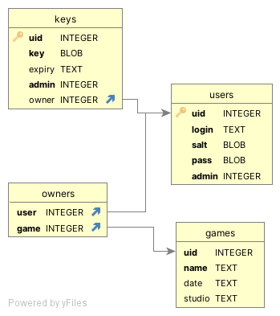

# Game Store API

A demo backend API for an online game store.

## API Endpoints

1. GET /games
    Returns all games in the database in the JSON format.
    Arguments:
    - name:str
        A string that each result's name must contain
    - studio:str
        A string that each result's studio must contain
    - date:str(10)
        A string that each result's release date must contain

2. POST /games
    Returns all owned games by the user associated with the provided key.
    Arguments:
    - key:str
        Key used for authentication

3. POST /games/delete
    Deletes a game entry from the database with the provided uid.
    Arguments:
    - key:str
    - uid:int
        Id of game to be deleted

4. POST /games/add
    Adds a new game entry to the database with the attributes in arguments.
    Arguments:
    - key:str
    - name:str
    - date:str
    - studio:str

5. POST /games/update
    Updates a single game entry attribute.
    - key:str
    - uid:int
    - attr:str
        Attribute key to be updated.
    - val:str
        Value to update the attribute with.

6. POST /key/valid
    Returns if the key in POST arguments is valid.
    1. POST /key/valid/admin
        Returns if the key in POST arguments is valid and admin capable.  
    Arguments:
    - key:str

7. POST /key/register
    Registers the user and makes him eligible to receive keys.
    Arguments:
    - login:str
        A user login that will be later used for verification during key issuing.
    - pass:str
        A user password used in tandem with login.

8. POST /key/get
    Issues a new key for the user, with a permission level fitting their user permission level.
    Arguments:
    - login:str
    - pass:str
    - expiry:str
        Either "auto" meaning tomorrow, a date formatted in "YYYY-MM-DD" or not provided (null) meaning never.
        Perpetual keys may only be issued by admins.

## Authentication

Authentication is not necessary for all GET endpoints, and is provided in POST requests via the use of a key attribute in all requests.
The exception to that are the /key/register and /key/get endpoints that are used in key issue process.
This system ensures the backend can verify user identity without exposing any of their credentials, while also allowing access to automated clients and having two levels of authority over served content.
What's more this system has a built in key expiry that may only be turned off for keys generated by admins.
A frontend client can easily initialize secure data exchange by obtaining a one day valid key via the get endpoint and then use that key in all endpoints requiring authentication.
Admin users cannot be created without manual access to the database, which is a security feature.

## Database

Due to it's relative simplicity and my experience with it I chose sqlite as the engine to power the database.
It removes a lot of the unnecessary data types from SQL while keeping all the necessary features.  


## Example commands for testing

```Bash
curl -X GET localhost:8080/games
#outputs json contents of table games
curl -d "key=4shrg654ccI=" -X POST localhost:8080/key/valid
#true
curl -d "key=4shrg654ccI=" -X POST localhost:8080/key/valid/admin
#false
curl -d "key=test" -X POST localhost:8080/key/valid/admin
#true
curl -d "key=4shrg654ccI=" -X POST localhost:8080/games
#[{"date":"1993-12-10","studio":"ID","name":"Doom"}]
curl -d "login=test&pass=1234&expiry=auto" -X POST localhost:8080/key/get
#json with key and expiry
```

## Notes

- I had trouble with Java setup, thus two jar files are bundled.
- The games table has very little columns, but that's not important and can be easily changed.
